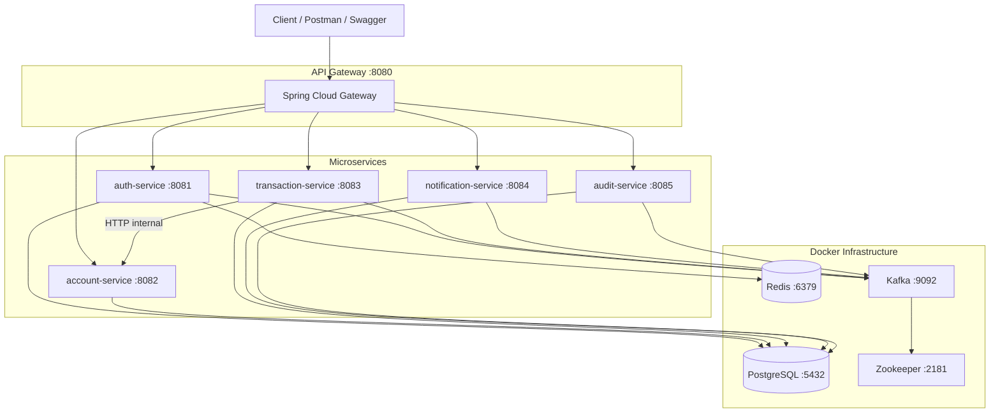

# Digital Banking Platform

A microservices-based digital banking backend built with **Java 21** and **Spring Boot 3.3**. It covers user authentication, KYC verification, account management, money transfers, scheduled payments, notifications, and audit logging — all exposed through a single **API Gateway**.

> **Portfolio project** — designed for learning and demonstration. Not production-ready without additional hardening.

---

## Features

- **User registration & login** with JWT (stateless authentication)
- **KYC workflow** — submit, admin review, approve/reject
- **Bank accounts** — create savings/current accounts, check balance
- **Transfers** — immediate transfers between accounts
- **Daily transfer limit** — ₹50,000 per user per day
- **Beneficiaries** — save frequently used payees
- **Scheduled transfers** — cron-based future payments
- **Notifications** — in-app alerts via Kafka events
- **Audit logs** — immutable admin-only audit trail
- **API Gateway** — single entry point on port 8080
- **Redis** — login rate limiting and JWT logout blacklist

---

## Architecture



### Event flow (Kafka)

| Producer | Topic | Consumer |
|----------|-------|----------|
| auth-service | `banking.auth.events` | notification-service |
| auth-service | `banking.audit.events` | audit-service |
| transaction-service | `banking.transaction.events` | notification-service |
| transaction-service | `banking.audit.events` | audit-service |

---

## Tech Stack

| Layer | Technology |
|-------|------------|
| Language | Java 21 |
| Framework | Spring Boot 3.3.5, Spring Cloud Gateway |
| Security | Spring Security + JWT (JJWT 0.12.6) |
| Database | PostgreSQL 16 (schema-per-service) |
| Migrations | Flyway |
| Cache | Redis 7 |
| Messaging | Apache Kafka 7.6 (Confluent) |
| API Docs | SpringDoc OpenAPI (Swagger UI at `/docs`) |
| Build | Maven (multi-module) |
| Containers | Docker Compose |

---

## Services & Ports

| Service | Port | Swagger Docs |
|---------|------|--------------|
| **api-gateway** | 8080 | — |
| auth-service | 8081 | http://localhost:8081/docs |
| account-service | 8082 | http://localhost:8082/docs |
| transaction-service | 8083 | http://localhost:8083/docs |
| notification-service | 8084 | http://localhost:8084/docs |
| audit-service | 8085 | http://localhost:8085/docs |

**All client requests should go through the gateway:** `http://localhost:8080`

---

## Prerequisites

- **Java 21** (JDK)
- **Maven 3.9+**
- **Docker Desktop** (for Postgres, Redis, Kafka, Zookeeper)

---

## Quick Start

### 1. Clone the repository

```bash
git clone https://github.com/Viswas-GA/digital-banking-platform.git
cd digital-banking-platform
```

### 2. Start infrastructure

```bash
docker compose up -d postgres redis zookeeper kafka
```

Wait until services are healthy:

```bash
docker compose ps
```

### 3. Start microservices

Open separate terminals for each service:

```bash
mvn -pl auth-service -am spring-boot:run
mvn -pl account-service -am spring-boot:run
mvn -pl transaction-service -am spring-boot:run
mvn -pl notification-service -am spring-boot:run
mvn -pl audit-service -am spring-boot:run
mvn -pl api-gateway -am spring-boot:run
```

### 4. Verify gateway is up

```bash
curl http://localhost:8080/api/v1/gateway/health
```

---

## End-to-End Test Flow

All steps use the **gateway** at `http://localhost:8080`.

### Step 1 — Register a user

```http
POST /api/v1/auth/register
Content-Type: application/json

{
  "email": "alice@example.com",
  "password": "password123",
  "firstName": "Alice",
  "lastName": "Smith",
  "phone": "9876543210"
}
```

Save the `accessToken` from the response.

### Step 2 — Submit KYC

```http
POST /api/v1/kyc/submit
Authorization: Bearer <token>
```

### Step 3 — Promote & login as admin

```bash
docker exec banking-postgres psql -U banking -d banking -c \
  "UPDATE auth.users SET role = 'ADMIN' WHERE email = 'admin@example.com';"
```

Then login as admin and approve KYC:

```http
POST /api/v1/kyc/admin/<userId>/approve
Authorization: Bearer <admin-token>
```

### Step 4 — Re-login as user (get VERIFIED in JWT)

```http
POST /api/v1/auth/login
```

> KYC status is embedded in the JWT. **Re-login after approval** to get `kycStatus: VERIFIED`.

### Step 5 — Create accounts & fund

```http
POST /api/v1/accounts
Authorization: Bearer <token>

{ "accountType": "SAVINGS", "currency": "INR" }
```

Fund via SQL (accounts start at balance 0):

```bash
docker exec banking-postgres psql -U banking -d banking -c \
  "UPDATE account.accounts SET balance = 10000.00 WHERE id = '<account-id>';"
```

### Step 6 — Transfer money

```http
POST /api/v1/transactions/transfer
Authorization: Bearer <token>

{
  "fromAccountId": "<uuid>",
  "toAccountNumber": "ACCT...",
  "amount": 250.00,
  "description": "Rent payment"
}
```

### Step 7 — Check notifications & audit logs

```http
GET /api/v1/notifications
Authorization: Bearer <token>
```

```http
GET /api/v1/admin/audit-logs?page=0&size=20
Authorization: Bearer <admin-token>
```

---

## API Reference

All paths are relative to `http://localhost:8080`.

### Authentication

| Method | Endpoint | Auth | Description |
|--------|----------|------|-------------|
| GET | `/api/v1/auth/health` | No | Health check |
| POST | `/api/v1/auth/register` | No | Register new user |
| POST | `/api/v1/auth/login` | No | Login and get JWT |
| POST | `/api/v1/auth/logout` | Yes | Invalidate current JWT (Redis) |
| GET | `/api/v1/auth/me` | Yes | Current user profile |

### KYC

| Method | Endpoint | Auth | Description |
|--------|----------|------|-------------|
| POST | `/api/v1/kyc/submit` | Yes | Submit KYC documents |
| GET | `/api/v1/kyc/status` | Yes | Get KYC status |
| GET | `/api/v1/kyc/admin/pending` | Admin | List pending submissions |
| POST | `/api/v1/kyc/admin/{userId}/approve` | Admin | Approve KYC |
| POST | `/api/v1/kyc/admin/{userId}/reject` | Admin | Reject KYC |

### Accounts

| Method | Endpoint | Auth | Description |
|--------|----------|------|-------------|
| GET | `/api/v1/accounts/health` | No | Health check |
| POST | `/api/v1/accounts` | Yes + VERIFIED KYC | Create account |
| GET | `/api/v1/accounts` | Yes | List my accounts |
| GET | `/api/v1/accounts/{id}` | Yes | Get account details |
| GET | `/api/v1/accounts/{id}/balance` | Yes | Get balance |
| POST | `/api/v1/accounts/transfer` | Yes | Transfer between own accounts |

### Transactions

| Method | Endpoint | Auth | Description |
|--------|----------|------|-------------|
| GET | `/api/v1/transactions/health` | No | Health check |
| POST | `/api/v1/transactions/transfer` | Yes + VERIFIED KYC | Transfer money |
| GET | `/api/v1/transactions` | Yes | Transaction history |
| GET | `/api/v1/transactions/limits` | Yes | Daily transfer limit info |

### Beneficiaries

| Method | Endpoint | Auth | Description |
|--------|----------|------|-------------|
| POST | `/api/v1/beneficiaries` | Yes | Add beneficiary |
| GET | `/api/v1/beneficiaries` | Yes | List beneficiaries |
| DELETE | `/api/v1/beneficiaries/{id}` | Yes | Remove beneficiary |

### Scheduled Transfers

| Method | Endpoint | Auth | Description |
|--------|----------|------|-------------|
| POST | `/api/v1/scheduled-transfers` | Yes | Schedule a transfer |
| GET | `/api/v1/scheduled-transfers` | Yes | List scheduled transfers |
| DELETE | `/api/v1/scheduled-transfers/{id}` | Yes | Cancel scheduled transfer |

### Notifications

| Method | Endpoint | Auth | Description |
|--------|----------|------|-------------|
| GET | `/api/v1/notifications/health` | No | Health check |
| GET | `/api/v1/notifications` | Yes | List notifications |
| GET | `/api/v1/notifications/unread-count` | Yes | Unread count |
| POST | `/api/v1/notifications/{id}/read` | Yes | Mark as read |

### Audit (Admin only)

| Method | Endpoint | Auth | Description |
|--------|----------|------|-------------|
| GET | `/api/v1/admin/audit-logs/health` | No | Health check |
| GET | `/api/v1/admin/audit-logs` | Admin | Search audit logs |

### Gateway

| Method | Endpoint | Auth | Description |
|--------|----------|------|-------------|
| GET | `/api/v1/gateway/health` | No | Gateway + route status |

---

## Project Structure

```
digital-banking-platform/
├── common/                 # Shared exceptions, Kafka events, DTOs
├── auth-service/           # Registration, login, JWT, KYC, Redis
├── account-service/        # Accounts, balance, transfers
├── transaction-service/    # Transfers, beneficiaries, scheduled jobs
├── notification-service/   # Kafka consumer → in-app notifications
├── audit-service/          # Kafka consumer → immutable audit logs
├── api-gateway/            # Spring Cloud Gateway (single entry point)
├── infra/postgres/init/    # Database schema initialization
├── scripts/                # PowerShell smoke test scripts
├── docker-compose.yml      # Postgres, Redis, Kafka, Zookeeper
└── pom.xml                 # Parent Maven POM
```

Each service owns a **PostgreSQL schema**: `auth`, `account`, `transaction`, `notification`, `audit`.

---

## Running Tests

```bash
# Unit tests (no Docker required for most)
mvn test

# Full integration tests (requires Postgres running)
docker compose up -d postgres
mvn test
```

### Smoke tests (PowerShell)

```powershell
# Auth only
.\scripts\smoke-test-auth.ps1

# Full flow via gateway
.\scripts\smoke-test-final.ps1
```

---

## Configuration

Key environment variables (all have sensible defaults for local dev):

| Variable | Default | Description |
|----------|---------|-------------|
| `JWT_SECRET` | (dev default in properties) | Shared JWT signing secret |
| `KAFKA_BOOTSTRAP_SERVERS` | `localhost:9092` | Kafka broker address |
| `KAFKA_ENABLED` | `true` | Toggle Kafka publishing/consuming |
| `REDIS_HOST` | `localhost` | Redis host |
| `REDIS_ENABLED` | `true` | Toggle Redis features |
| `LOGIN_RATE_LIMIT_MAX` | `5` | Max failed logins before lockout |
| `LOGIN_RATE_LIMIT_WINDOW_MINUTES` | `15` | Lockout window duration |

---

## Security Notes

- JWT is **stateless** — no server-side sessions
- Each microservice validates JWT independently using a **shared secret**
- **Re-login required** after KYC approval to refresh token claims
- Internal account transfer endpoint (`/api/v1/accounts/internal/**`) is **blocked at the gateway**
- Default credentials and JWT secret are for **local development only**
- Login rate limiting: 5 failed attempts → 15-minute lockout (Redis)
- Logout blacklists JWT in Redis until token expiry

---

## Business Rules

| Rule | Detail |
|------|--------|
| KYC required | Accounts and transfers need `kycStatus: VERIFIED` in JWT |
| Daily limit | ₹50,000 per user per day (immediate + scheduled transfers) |
| Account balance | Starts at ₹0 — fund via SQL for testing |
| Admin role | Promote via SQL: `UPDATE auth.users SET role = 'ADMIN' ...` |
| Scheduled transfers | Processed every minute by a cron job in transaction-service |

---

## License

This project is for educational and portfolio purposes.

---

## Author

**Viswas** — [GitHub @Viswas-GA](https://github.com/Viswas-GA)
